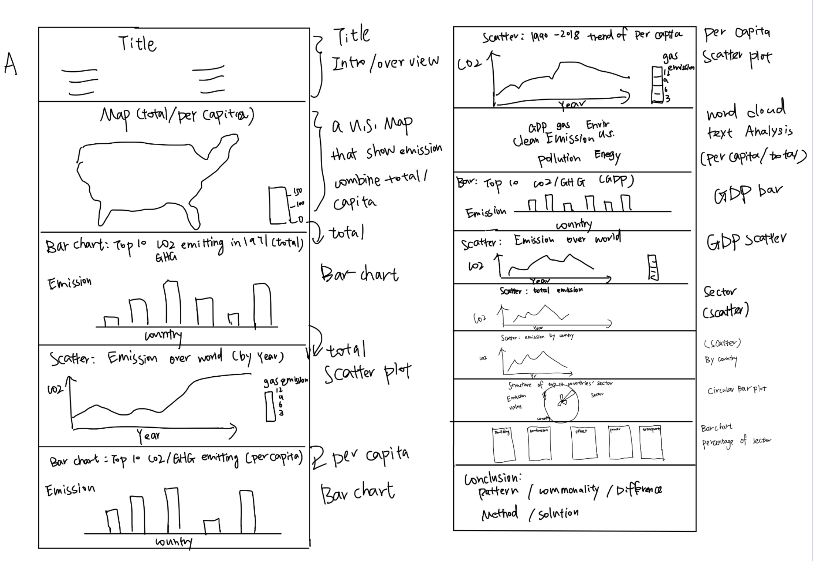

# Group_A_Carbon-Emission

## Introduction

- Group title: Group_A_Carbon-Emission

- Brief description: This project dedicated to studying the differences in greenhouse gas emissions across countries and sectors, and the measures they take to deal with greenhouse gas emissions.

- Our Final Outputs:
1. [`Process Book`](https://github.com/QMSS-G5063-2023/Group_A_Carbon-Emission/blob/main/ProcessBook/ProcessBook_GroupA.png)
2. [`Project Web Site`](https://groupa-carbon-emission.shinyapps.io/Final_Project_GroupA/)
3. [`Data`](https://github.com/QMSS-G5063-2023/Group_A_Carbon-Emission/tree/main/data)
4. [`Code`](https://github.com/QMSS-G5063-2023/Group_A_Carbon-Emission/blob/main/code%20and%20website/Final%20Project%20Code_GroupA.Rmd)
5. [`Final Presentation`](https://www.youtube.com/watch?v=xPGmCCfHj_Y)

## Data Description
There are 9 datasets used:

| Info                  | Description |
|-------------------------------|-------------|
| [`fossil_CO2_totals_by_country`](https://github.com/QMSS-G5063-2023/Group_A_Carbon-Emission/blob/main/data/CO2_totals.csv) | Total fossil CO2 emissions by country |
| [`fossil_CO2_by_sector_and_country`](https://github.com/QMSS-G5063-2023/Group_A_Carbon-Emission/blob/main/data/CO2_sector.csv) | Fossil CO2 emissions by sector and country |
| [`fossil_CO2_per_capita_by_country`](https://github.com/QMSS-G5063-2023/Group_A_Carbon-Emission/blob/main/data/CO2_capita_country.csv) | Fossil CO2 emissions per capita by country |
| [`fossil_CO2_per_GDP_by_country`](https://github.com/QMSS-G5063-2023/Group_A_Carbon-Emission/blob/main/data/CO2_GDP_country.csv) | Fossil CO2 emissions per GDP by country |
| [`GHG_totals_by_country`](https://github.com/QMSS-G5063-2023/Group_A_Carbon-Emission/blob/main/data/GHG_totals.csv) | Total greenhouse gas (GHG) emissions by country |
| [`GHG_by_sector_and_country`](https://github.com/QMSS-G5063-2023/Group_A_Carbon-Emission/blob/main/data/GHG_sector.csv) | GHG emissions by sector and country |
| [`GHG_per_capita_by_country`](https://github.com/QMSS-G5063-2023/Group_A_Carbon-Emission/blob/main/data/GHG_capita_country.csv) | GHG emissions per capita by country |
| [`GHG_per_GDP_by_country`](https://github.com/QMSS-G5063-2023/Group_A_Carbon-Emission/blob/main/data/GHG_GDP_country.csv) | GHG emissions per GDP by country |
| [`measures`](https://github.com/QMSS-G5063-2023/Group_A_Carbon-Emission/blob/main/data/measures.docx) | Text of the United States's measures to decarbonize |

The dataset contains the following columns:

| Column Name | Data Type | Description |
|-------------|-----------|-------------|
| Country     | character | Name of countries |
| Sector      | character | Industry each observation pertains |
| Substance   | character | Specific gas that is being measured |
| Macro-region| character | Geographical region |
| Year        | character | Year of collecting records |

## Process Book

## Names and E-mails of all members: 

|  Name   | E-mail  |
|  ---   | ---  |
|  Xueer Luo   | xl3276@columbia.edu  |
|  Qichen Xie  | qx2235@columbia.edu  |
| Jin Liu  | jl6276@columbia.edu |
| Weiwen Dai | wd2366@columbia.edu |

